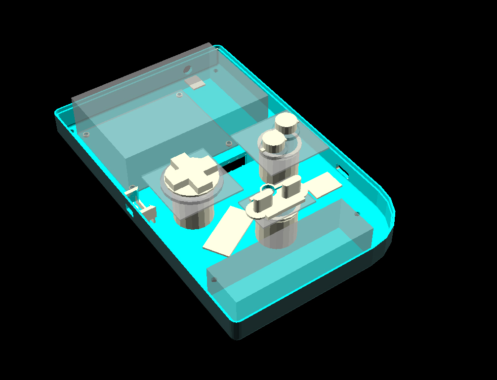

# gameboySCAD

An OpenSCAD project that tries to construct a copy of the original Gameboy for 3D printing.
The model also features custom back buttons that emulate Gameboy Advance LR buttons.
Used by the awesome [gameboi](https://github.com/emrsmsrli/gameboi) and [gameboiadvance](https://github.com/emrsmsrli/gameboiadvance) projects.

    

